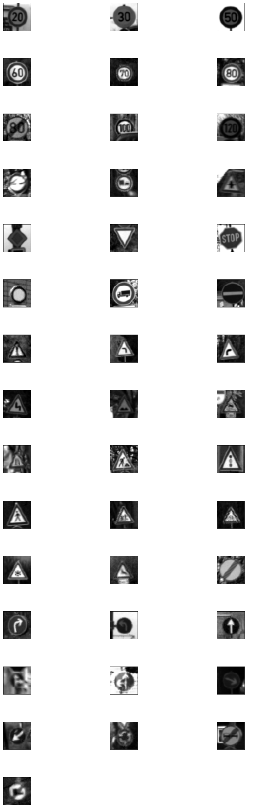
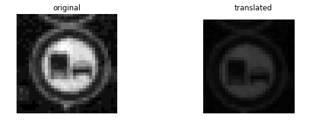

# Self-Driving Car Engineer Nanodegree

## Deep Learning

## Project: Build a Traffic Sign Recognition Classifier

The goals / steps of this project are the following:
* Load the data set (see below for links to the project data set)
* Explore, summarize and visualize the data set
* Design, train and test a model architecture
* Use the model to make predictions on new images
* Analyze the softmax probabilities of the new images
* Summarize the results with a written report

# Required Files
The html file and the corresponding writeup (this document) are available on [github](https://github.com/bkanaki/CarND-Traffic-Sign-Classifier-Project/). The Ipython notebook containing the code and the set of new images are also available on the same page.

---

## Dataset Summary & Exploration

The pickled data is a dictionary with 4 key/value pairs:

- `'features'` is a 4D array containing raw pixel data of the traffic sign images, (num examples, width, height, channels).
- `'labels'` is a 1D array containing the label/class id of the traffic sign. The file `signnames.csv` contains id -> name mappings for each id.
- `'sizes'` is a list containing tuples, (width, height) representing the original width and height the image.
- `'coords'` is a list containing tuples, (x1, y1, x2, y2) representing coordinates of a bounding box around the sign in the image. **THESE COORDINATES ASSUME THE ORIGINAL IMAGE. THE PICKLED DATA CONTAINS RESIZED VERSIONS (32 by 32) OF THESE IMAGES**

Here, I have used python libraries like numpy, pandas and matplotlib to visualize the input images and the distribution of the data.

    Number of training examples = 34799
    Number of validation examples = 4410
    Number of testing examples = 12630
    Image data shape = (32, 32, 3)
    Number of classes = 43

### An exploratory visualization of the dataset

One randomly selected sample from each class is shown in the image below. Their corresponding sign names are also shown in the title for once.

The data distribution of Training, Validation and Test samples is shown below, respectively.

#### Remark:
One interesting observation about these images is that many of them are very dull in contrast and brightness. Thus, it was a good idea to apply Contrast Limited Adaptive Histogram Equalization (CLAHE). This could, in turn, help in the higher accuracy of the classifier.

Moreover, the data is also highly skewed. Thus, it was a good idea to add random variations of the images and have a uniform training distribution. For this, combining the train and validation data would be a good idea. They can be split again later. (However, this was not done as I wasn't sure if that was allowed. So I proceeded with augmenting the given test data.)

----

## Design and Test a Model Architecture

### Pre-process the Data Set (normalization, grayscale, etc.)

The first step for any Machine Learning problem is data pre-processing. As a part of this step I 
Below, another random samples for each class are shown, but after grayscale conversion. The CLAHE function of OpenCV takes in the grayscaled images.

I then converted the train and validation images to grayscale. For all the grayscale conversion, I used Tensorflow functions just for learning purpose. Then, applied the CLAHE by using opencv function and plotted the transformed set of images.

These are much better than grayscale representation.

The image data is normalized so that the data has mean zero and equal variance. The data is normalized between -0.5 and 0.5 in this project. The training data samples again after data normalization are plotted again.

Other pre-processing steps include a combination of random translation, rotation and scale.

I really wanted to use Tensorflow library functions for data augmentation and I found [this](https://medium.com/ymedialabs-innovation/data-augmentation-techniques-in-cnn-using-tensorflow-371ae43d5be9) reference a lot useful for setting up the pipeline. But, it was a bit time consuming as there were some steps involved for generating samples in a way that balances total number of samples. Plus, the rotated version of TF function was very flakey. So I switched back to simple OpenCV grometric transforms.

One random sample picked from normalized training set and randomly translated. (The random translations are between -3 to 3 pixels in either direction.)

One random sample picked from normalized training set and randomly scaled. (The random scaling is between 0.9 to 1.1 of the original image size.)

One random sample picked from normalized training set and randomly rotated. (The random rotations are between -15 to 15 degrees in either direction.)

A combination of all these on one randomly selected image

These were then applied to get the even distribution of the classes. For each classes, augmented data is added in such a way that there are 2200 samples of each class in the training data.

    X_train shape: (94600, 32, 32)
    Total training images: 94600

### Model Architecture

There were several models tried. VGG like, LeNet and Sermanet. I followed the network architecture of [Sermanet and LeCunn](http://yann.lecun.com/exdb/publis/pdf/sermanet-ijcnn-11.pdf) paper as closely as possible. Although, they do not describe an architecture in the paper, it is not very hard to figure it out from the image they provide. The Convolutional kernel were selected based on the [VGG](https://arxiv.org/pdf/1409.1556.pdf) architecture because they argue that two convolutions layers with 3x3 kernels provides better representation than a single 5x5 layer. The depth of filters were selected to be power of 2 as that is a general trend.

My original intention was to use a VGG16 type network, however, I could not get a greater validation accuracy with this model even though the training accuracy reached ~99%. It was later I had realized that there was a bug in my evaluate code where I multiplied the batch size by 2 for validation, but missed to account for that when selecting the data. I haven't had the time to define the VGG type model again and see how it performs after that bug fix.

Another easy mistake one could do is to disable dropout while testing and validation. (I was one of them!)

Finally, here is the architecture I have used. For each convolutional layer Kernel = (3,3), Stride = (1,1), Padding = VALID, and ReLU Activation are used

* Layer 1: Convolutional. Input = 32x32x1. Output = 30x30x8.
* Layer 2: Convolutional. Input = 30x30x8. Output = 28x28x8.
* Pooling 1. Input = 28x28x8. Output = 14x14x8.    
* Layer 3: Convolutional. Input = 14x14x8. Output = 12x12x16.
* Layer 4: Convolutional. Input = 12x12x16. Output = 10x10x16.
* Pooling 2. Input = 10x10x16. Output = 5x5x16.    
* Layer 5: Convolutional. Input = 5x5x16. Output = 3x3x16.
* Layer 6: Convolutional. Input = 3x3x16. Output = 1x1x600. (The number of output filter can be experimented)
* Flatten the layers 4 and 6 and concatenate
* Layer 7: Concatenated fully connected layer. Input = 1000. Output = 43. Droupout layer with 0.5 probability

### Training the Model

For training the model, I used an Adam Optimizer as suggested in the notebook and various places on the internet. I used a step decayed learning rate with starter rate as 3e-4 for first 50 Epochs and 1e-5 for the next 50 Epochs, totalling to 100 Epochs. The batch size od 128 was used.

The training and validation loss curve are shown below.

The training and validation accuracy curve are shown below.

To sum up, the training accuracy was ~98 % and validation accuracy was ~96 %.

#### Evaluation of the model on the test data

    Test Accuracy = 93.5 %

---

## Test a Model on New Images

### Load and Output the Images

Following 8 images were downloaded from the internet. Their corresponding labels are also shown.

### Predicted Sign Type for Each Image

The following image shows the actual and predicted labels 

### Analyze Performance

    Accuracy on new images = 87.5

(As every time I was loading a new session, I was able to see different results). 

The one sign that is mis-classified is the 'Road narrows on right' with 'General caution'. It is likely that the straight lines in the sign would make the neural network confused between both the signs. We can look at the top 5 probabilities next to investigate how far off the prediction is.

### Output Top 5 Softmax Probabilities For Each Image Found on the Web

    True Class - 'Road work'
    Top 5 guesses  are as follows:
    Guess 1 - 'Road work' (with probability 1.00000)
    Guess 2 - 'Beware of ice/snow' (with probability 0.00000)
    Guess 3 - 'Bumpy road' (with probability 0.00000)
    Guess 4 - 'Traffic signals' (with probability 0.00000)
    Guess 5 - 'Road narrows on the right' (with probability 0.00000)
     
    True Class - 'Road narrows on the right'
    Top 5 guesses  are as follows:
    Guess 1 - 'General caution' (with probability 0.99673)
    Guess 2 - 'Traffic signals' (with probability 0.00321)
    Guess 3 - 'Pedestrians' (with probability 0.00003)
    Guess 4 - 'Road narrows on the right' (with probability 0.00002)
    Guess 5 - 'Bumpy road' (with probability 0.00000)
     
    True Class - 'No entry'
    Top 5 guesses  are as follows:
    Guess 1 - 'No entry' (with probability 0.99979)
    Guess 2 - 'Speed limit (100km/h)' (with probability 0.00020)
    Guess 3 - 'Speed limit (20km/h)' (with probability 0.00001)
    Guess 4 - 'Stop' (with probability 0.00000)
    Guess 5 - 'Speed limit (120km/h)' (with probability 0.00000)
     
    True Class - 'Priority road'
    Top 5 guesses  are as follows:
    Guess 1 - 'Priority road' (with probability 0.99966)
    Guess 2 - 'Speed limit (20km/h)' (with probability 0.00016)
    Guess 3 - 'Stop' (with probability 0.00007)
    Guess 4 - 'Keep right' (with probability 0.00006)
    Guess 5 - 'Ahead only' (with probability 0.00003)
     
    True Class - 'Speed limit (30km/h)'
    Top 5 guesses  are as follows:
    Guess 1 - 'Speed limit (30km/h)' (with probability 0.68676)
    Guess 2 - 'Speed limit (20km/h)' (with probability 0.31324)
    Guess 3 - 'Speed limit (50km/h)' (with probability 0.00000)
    Guess 4 - 'Speed limit (80km/h)' (with probability 0.00000)
    Guess 5 - 'Speed limit (120km/h)' (with probability 0.00000)
     
    True Class - 'Beware of ice/snow'
    Top 5 guesses  are as follows:
    Guess 1 - 'Beware of ice/snow' (with probability 0.99791)
    Guess 2 - 'Children crossing' (with probability 0.00188)
    Guess 3 - 'Go straight or left' (with probability 0.00015)
    Guess 4 - 'Turn left ahead' (with probability 0.00005)
    Guess 5 - 'Road work' (with probability 0.00000)
     
    True Class - 'Children crossing'
    Top 5 guesses  are as follows:
    Guess 1 - 'Children crossing' (with probability 0.96364)
    Guess 2 - 'Beware of ice/snow' (with probability 0.03576)
    Guess 3 - 'Bicycles crossing' (with probability 0.00058)
    Guess 4 - 'Right-of-way at the next intersection' (with probability 0.00002)
    Guess 5 - 'Road work' (with probability 0.00000)
     
    True Class - 'Right-of-way at the next intersection'
    Top 5 guesses  are as follows:
    Guess 1 - 'Right-of-way at the next intersection' (with probability 0.99894)
    Guess 2 - 'Beware of ice/snow' (with probability 0.00106)
    Guess 3 - 'Turn left ahead' (with probability 0.00000)
    Guess 4 - 'Children crossing' (with probability 0.00000)
    Guess 5 - 'Ahead only' (with probability 0.00000)
     
